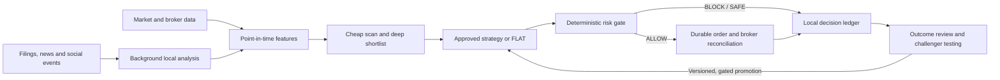

# JARVIS — local autonomous investing research and trading

JARVIS is a **proposed**, owner-only system for finding and managing opportunities in liquid US equities and spot BTC/ETH. It follows the original vision's **Observe → Understand → Forecast → Decide → Execute → Learn** loop: collect market and information events, create trustworthy features, find candidates, choose among tested strategies, apply hard risk limits, execute eligible orders, and learn from recorded outcomes. The first target is opportunities lasting **hours to days**, not a promise of constant profit or high-frequency trading.

**Project status (October 2026): documentation and legacy prototype only.** The autonomous engine, broker adapter, learning loop, and runtime agents described below do not exist yet. Do not connect a live account to the legacy code. The current branch documents the revised direction before implementation or repository reorganization.

## Start here

| Read | Purpose |
|---|---|
| [Autonomous architecture](AUTONOMOUS_ARCHITECTURE.md) | Current proposed product, data cadences, decision flow, local storage, risk boundaries and learning loop. |
| [Architecture diagrams](docs/04-autonomous-design/DIAGRAMS.md) | Visual map of the two data queues and of one candidate's path to a possible order. |
| [Delivery roadmap](docs/04-autonomous-design/ROADMAP.md) | Build sequence, exit tests and failure cases. |
| [Revision decisions](docs/04-autonomous-design/DECISIONS.md) | What changed from the monthly design and where all 18 original v3 functions went. |
| [Original vision](docs/00-original-vision/) | The owner's v1/v2/v3 workflow and legacy-system assessment. |
| [October 2 architecture](ARCHITECTURE.md) | Historical, paper-grounded monthly recommendation proposal. Retained for its evidence and open questions; its runtime scope is superseded by the autonomous proposal. |
| [Research and review](docs/01-research/) · [Design tournament](docs/02-design-tournament/) · [Specialist review](docs/03-review/) | The earlier evidence and reasoning; claims tagged RECALLED, SNIPPET or UNVERIFIED still need checking. |
| [Project log](docs/LOG.md) · [Contributing](CONTRIBUTING.md) | Chronology and collaboration rules. |

## Repository map

```text
README.md                         Start here and current project status
AUTONOMOUS_ARCHITECTURE.md       Current proposed product and technical design
docs/04-autonomous-design/       Diagrams, decisions, delivery roadmap
ARCHITECTURE.md                  Historical October 2 monthly proposal
docs/00-original-vision/        Original v1/v2/v3 workflow and legacy assessment
docs/01-research/               Earlier evidence and gap analysis
docs/02-design-tournament/      Earlier competing designs and critiques
docs/03-review/                 Earlier specialist and verification reviews
docs/LOG.md                     Dated decision history
legacy-v1/                      Reference TSLA prototype, not an active engine
```

There is currently no autonomous runtime to install or launch. The roadmap describes the order in which code, data adapters, strategy specs and tests would be added.

## How a decision would work



The information pipeline retains JARVIS's original local summarisation, event tagging, sentiment and feature-engineering idea. It runs **separately** from the timely market/order path. It processes each relevant item once, prioritises held assets and shortlisted candidates, and publishes timestamped features. A positive headline or high sentiment score is **not** an order; a strategy must show useful evidence after costs, then pass the risk gate. The old TSLA models are reference material, not trusted predictors: their saved results contain target leakage.

| Lane | Intended first-version rhythm | Limitation |
|---|---|---|
| Equities | Hourly broad scan during regular market hours; daily context; deep text analysis for a small shortlist. | On Alpaca Basic, real-time equity data is IEX-only and full-market data is delayed by 15 minutes. [Alpaca plans](https://docs.alpaca.markets/us/docs/about-market-data-api). |
| Spot BTC/ETH | Collect live minute bars while online; make first-version strategy decisions on hourly features; monitor orders and exits while online. | Crypto trading eligibility, fees, venue and quote behaviour need an account probe. The laptop may miss events while asleep. |
| Learning | Review outcomes after each strategy's horizon; periodically evaluate challenger versions in replay and shadow. | One profitable or losing trade is not enough to rewrite a strategy. New families and a paper-to-live switch need owner approval. |

## What is automatic and what the owner controls

Within a signed operating envelope, JARVIS is intended to scan, select an approved strategy, size and submit a permitted order, monitor the position, and record an outcome **without manual entry of every trade**. The owner sets the allowable universe, risk and loss limits, large-order threshold, and live permission; can halt trading immediately; and approves new strategy families or loosening of the envelope. The risk governor and broker reconciliation are deterministic. Claude and Codex may help build and review the software but have no live broker or order authority.

The first deployment is paper-only. A live pilot follows only after data licences and account permissions are verified, point-in-time replay and crash/recovery drills pass, the owner signs a risk envelope, and broker state reconciles cleanly. Paper fills do not establish live returns or execution quality. [Alpaca's paper-trading limits](https://docs.alpaca.markets/us/v1.4.2/docs/paper-trading).

## Data, storage and local runtime

The proposed runtime is one lean Python service on the owner's Windows 11 laptop, with bounded background text processing. **SQLite** holds durable decisions, candidates, orders, fills, outcomes and work queues; **Parquet** holds larger market/feature history; immutable model artifacts record each trained version. Secrets stay in the OS credential store, and encrypted local backups are tested. The code repository is not a live-account ledger. On restart, JARVIS reconciles the broker first and expires old opportunities rather than chasing them.

The original 18-role workflow is preserved as **18 responsibilities**, mapped to code, models or research agents in the [decision record](docs/04-autonomous-design/DECISIONS.md). The number of LLM processes is not a measure of intelligence. No trading system can guarantee steady returns; each proposed source, feature and strategy must earn its place through reproducible, cost-aware tests.

## Legacy material and safety

[`legacy-v1/`](legacy-v1/) is the TSLA Gradio chatbot and saved artifacts, not a production starting point. The owner's archived Colab notebooks additionally demonstrate portfolio inputs and local price/news collection, summarisation, tagging and CSV features; the archive contains an exposed search API key. The legacy Space previously contained an OpenAI key. **Revoke any still-active exposed keys before account setup.** Never commit keys, account numbers, tax IDs, or private trading records.

See [CONTRIBUTING.md](CONTRIBUTING.md) before proposing edits. This repository describes software and research; it is not investment, tax or legal advice.
