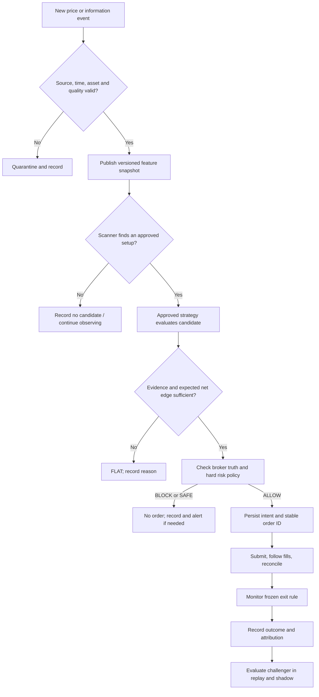

# JARVIS diagrams

**Proposed design; no runtime code exists yet.** These Mermaid diagrams render directly on GitHub. They preserve the original Observe → Understand → Forecast → Decide → Execute → Learn loop while keeping slow text processing outside the order path.

## Component and data-flow diagram

```mermaid
flowchart LR
  subgraph O["OBSERVE"]
    M["Equity and crypto market feeds"]
    B["Broker account and order events"]
    T["Permitted news, SEC, RSS and social sources"]
  end
  subgraph U["UNDERSTAND / INVESTIGATE"]
    MQ["Timely market queue"]
    TQ["Background text queue"]
    NLP["Deduplicate, map asset, summarize, classify"]
    FS["Point-in-time feature snapshots"]
    SC["Cheap broad scan; deep shortlist"]
  end
  subgraph F["FORECAST / VALIDATE"]
    ML["Approved strategy models and baselines"]
    SEL["Strategy selector or FLAT"]
  end
  subgraph D["DECIDE / READY"]
    GOV["Deterministic capital governor and risk gate"]
  end
  subgraph X["EXECUTE / MANAGE"]
    INT["Durable order intent"]
    EX["Broker adapter, fills, reconcile"]
    PM["Position and exit monitor"]
  end
  subgraph L["LEARN / AUDIT"]
    DB[("Local SQLite decision and trade ledger")]
    PQ[("Parquet market and feature history")]
    EV["Outcome attribution and challenger evaluation"]
    REG["Versioned model registry"]
    REP["Owner report and alerts"]
  end
  M --> MQ --> FS
  T --> TQ --> NLP --> FS
  FS --> SC --> ML --> SEL --> GOV
  B --> MQ
  B --> EX
  GOV -->|"ALLOW only"| INT --> EX --> PM
  GOV -->|"BLOCK / SAFE"| DB
  SC --> DB
  FS --> PQ
  EX --> DB
  PM --> DB
  DB --> EV --> REG
  REG -->|"tested champion only"| ML
  DB --> REP
  EV --> REP
```

The text queue cannot block the market queue. A strategy reads a text feature only when its own contract requires that feature and it is fresh and trusted. Learning publishes a new *version* through the registry; it never mutates the live model in place.

## One candidate's decision path

The first live version targets hours-to-days decisions. It is automatic **while the laptop is awake and connected**, with expiry and reconciliation on restart; it does not promise uninterrupted 24/7 crypto execution.
